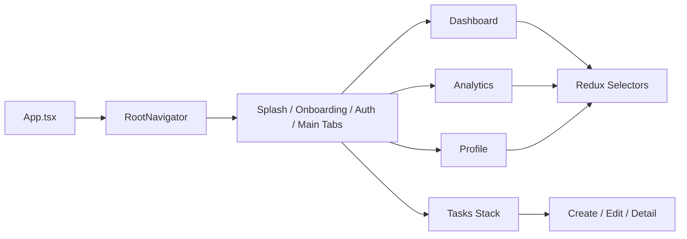
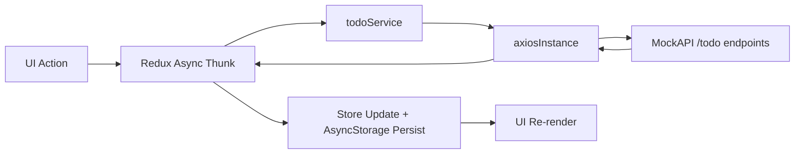
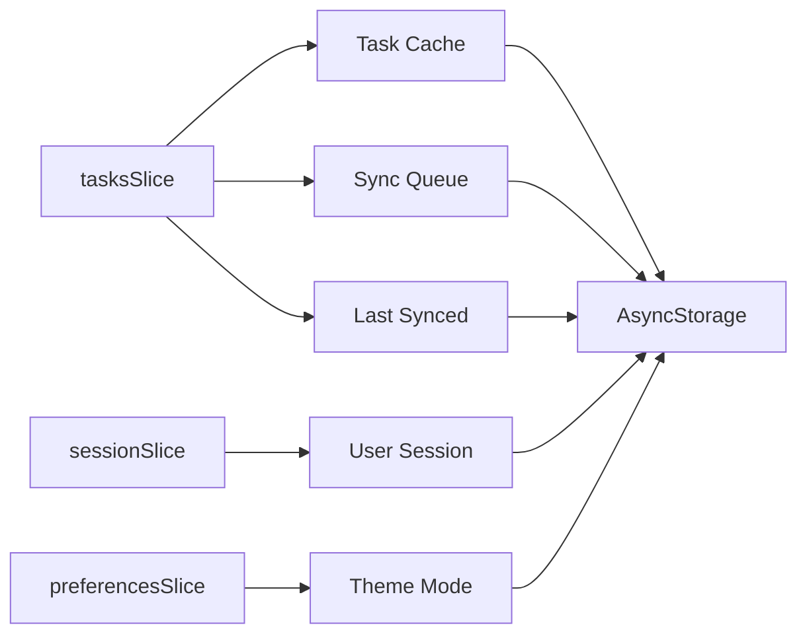

# MediTask Pro Design Document

## 1. System Overview

### Problem Statement
Dr. Nimal handles a large number of time-sensitive medical tasks on mobile. Existing workflows suffer from poor prioritization, weak structure, low visibility, and no meaningful productivity insights, which increases the risk of missing critical actions.

### Proposed Solution
MediTask Pro is a React Native mobile application focused on:
- Fast task capture and updates
- Priority-aware decision support
- Clean and accessible UI
- Offline-safe operation with queued synchronization
- Daily workload visibility and productivity tracking

### Tech Stack Justification
- React Native CLI: strong native performance and Android/iOS portability.
- TypeScript strict mode: safer refactors and fewer runtime defects.
- Redux Toolkit: predictable global state for tasks, session, and preferences.
- Axios: centralized API handling and consistent error normalization.
- React Navigation: scalable navigation for auth + tab + task stack flows.
- React Hook Form + Yup: reliable validation and reusable form handling.
- AsyncStorage: lightweight local persistence for cache, queue, and user settings.

## 2. Architecture Diagram

### Component Interaction

### API Flow

### State Management Flow

## 3. Wireframes

### Low Fidelity
- See: [`LOW_FIDELITY_WIREFRAMES.md`](LOW_FIDELITY_WIREFRAMES.md)

### High Fidelity (Figma Link)
- [MediTask Pro Screen Wireframe Flow](https://www.figma.com/online-whiteboard/create-diagram/6d339ba3-79fa-4904-9810-7df4211289e5?utm_source=other&utm_content=edit_in_figjam&oai_id=&request_id=bfc70d8b-d214-48e9-8b15-ae8c47d9cd2d)

## 4. Assumptions

- Primary usage target is Android devices.
- Network is usually available but can be unstable during rounds.
- Tasks are lightweight text records with priority and status.
- Single-user local session is sufficient for assessment scope.
- Push reminders and telemetry are intentionally out of scope for v1.

## 5. User Guide

1. Install dependencies and run app on device/emulator.
2. Open app and complete onboarding/authentication.
3. Add a task from Dashboard FAB or Task List.
4. Enter title, description, and priority; save.
5. Open task detail to toggle status or edit content.
6. Delete from swipe action in list or delete button in detail.
7. Use search/filter in Task List for quick retrieval.
8. Pull-to-refresh or use `Sync now` when needed.
9. Review daily progress in Dashboard and Analytics.
10. Open Profile > Appearance and switch theme (`System`, `Light`, `Dark`).

## 6. Quality and Delivery Checklist

- TypeScript strict mode enabled.
- ESLint + Prettier configured.
- Husky pre-commit runs lint and typecheck.
- CI pipeline builds and uploads Android debug APK artifact.
- Manual demo flow checklist is documented in [`DEMO_CHECKLIST.md`](DEMO_CHECKLIST.md).
